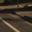

##Writeup Template
###You can use this file as a template for your writeup if you want to submit it as a markdown file, but feel free to use some other method and submit a pdf if you prefer.

---

**Vehicle Detection Project**

The goals / steps of this project are the following:

* Perform a Histogram of Oriented Gradients (HOG) feature extraction on a labeled training set of images and train a classifier Linear SVM classifier
* Optionally, you can also apply a color transform and append binned color features, as well as histograms of color, to your HOG feature vector. 
* Note: for those first two steps don't forget to normalize your features and randomize a selection for training and testing.
* Implement a sliding-window technique and use your trained classifier to search for vehicles in images.
* Run your pipeline on a video stream (start with the test_video.mp4 and later implement on full project_video.mp4) and create a heat map of recurring detections frame by frame to reject outliers and follow detected vehicles.
* Estimate a bounding box for vehicles detected.

[//]: # (Image References)
[image1]: ./examples/car_not_car.png
[image2]: ./examples/features.png
[image3]: ./examples/1_sliding_windows.png

[image4]: ./examples/2_detected_boxes.png
[image4_2]: ./examples/023.png
[image4_3]: ./examples/test3.png

[image5]: ./test_images/test4.jpg
[image6]: ./test_images/test5.jpg
[image7]: ./test_images/test6.jpg

[image8]: ./examples/test4.png
[image9]: ./examples/test5.png
[image10]: ./examples/test6.png

[image11]: ./examples/det_test6.png
[image12]: ./examples/det_test6.png

[image13]: 
[image14]: ./examples/udacity_notcar_sample.png

[video1]: ./project_video.mp4

## [Rubric](https://review.udacity.com/#!/rubrics/513/view) Points
###Here I will consider the rubric points individually and describe how I addressed each point in my implementation.  

---
###Writeup / README

####1. Provide a Writeup / README that includes all the rubric points and how you addressed each one.  You can submit your writeup as markdown or pdf.  [Here](https://github.com/udacity/CarND-Vehicle-Detection/blob/master/writeup_template.md) is a template writeup for this project you can use as a guide and a starting point.  

You're reading it!

###Histogram of Oriented Gradients (HOG)

####1. Explain how (and identify where in your code) you extracted HOG features from the training images.

The code for this step is contained in lines 12 through 78 of the file called `train.py`).  

I started by reading in all the `vehicle` and `non-vehicle` images.  
Here is an example of one of each of the `vehicle` and `non-vehicle` classes:

![alt text][image1]

I also tried extracting images from the Udacity datasets from (https://github.com/udacity/self-driving-car/tree/master/annotations).
I did this automatically by getting the car rects for the car dataset, and doing a sliding search window for parts that don't overlap with any
of the car rects. This is done in the `udacityDatasetExtraction` folder. 

I then explored different color spaces and different `skimage.hog()` parameters (`orientations`, `pixels_per_cell`, and `cells_per_block`).  
I grabbed random images from each of the two classes and displayed them to get a feel for what the `skimage.hog()` output looks like.

Here is an example using the `YCrCb` color space and HOG parameters of `orientations=9`, `pixels_per_cell=(8, 8)` and `cells_per_block=(1, 11)`:

![alt text][image2]

####2. Explain how you settled on your final choice of HOG parameters.

I tried various combinations of parameters and both looked at the test accuracy and tested it on sets of images, to see 
what the actual results were. I found the current combination to be the best regarding the balance between good positive
detection and reduced false positives, together with a reasonable performance.

I used a test program, `test.py` to grab a number of video screenshots and quickly get a feel of the performance of the
pipeline(including the time per frame).

Final parameters for HOG are 9 orientations, 8 pixels/cell and 1 cell/block.

####3. Describe how (and identify where in your code) you trained a classifier using your selected HOG features (and color features if you used them).

I trained a linear SVM in `train.py`, starting with the SVC definition in line 80. I trained it on 6000 samples of car/
not car images. I also tried other classifiers and kernels
- SVC with 'rbf' kernel and several manually variated parameters
- SVC with 'rbf' kernel and using RandomizedSearchCV to optimize the parameters automatically
- Decision trees
- RandomForestClassifier

In the end I decided the linear SVC was sufficiently good at classifying the data and in general the training and processing
 data was very reasonable, so I decided to stick with it.

###Sliding Window Search

####1. Describe how (and identify where in your code) you implemented a sliding window search.  How did you decide what scales to search and how much to overlap windows?

I decided to search for cars on the lower half of the image, using subsampling. First I took the HOG features for the whole
image on each channel(lines 78-83, `pipeline.py`). Then, a window is slid across the image with some amount of overlapping.
I tried using two window sizes to catch both close and further cars, but the added processing time didn't render much
 better detection, with higher false positives as well. So the final implementation uses a single window size.

The next image shows how the search space is filled with the sliding windows, when using two window sizes. 
In red is one window size, and in blue the other.

![alt text][image3]

####2. Show some examples of test images to demonstrate how your pipeline is working.  What did you do to optimize the performance of your classifier?

Ultimately I searched on a single scales using YCrCb 3-channel HOG features plus spatially binned color and histograms of 
color in the feature vector, which provided a nice result.  Here are some example images:

![alt text][image4]
![alt text][image4_2]
![alt text][image4_3]
---

### Video Implementation

####1. Provide a link to your final video output.  Your pipeline should perform reasonably well on the entire project video (somewhat wobbly or unstable bounding boxes are ok as long as you are identifying the vehicles most of the time with minimal false positives.)
Here's a [link to my video result](./result_video.mp4)

####2. Describe how (and identify where in your code) you implemented some kind of filter for false positives and some method for combining overlapping bounding boxes.

I recorded the positions of positive detections in each frame of the video. 
From the positive detections I created a heatmap and then thresholded that map to identify vehicle positions.  
I then used `scipy.ndimage.measurements.label()` to identify individual blobs in the heatmap.  
I then assumed each blob corresponded to a vehicle.  
I constructed bounding boxes to cover the area of each blob detected.  

Here's an example result showing the heatmap from a series of frames of video, the result of `scipy.ndimage.measurements.label()` 
and the bounding boxes then overlaid on the last frame of video:

### Here are three frames and their corresponding heatmaps:

![alt text][image5]
![alt text][image8]
![alt text][image6]
![alt text][image9]
![alt text][image7]
![alt text][image10]

### Here is the output of `scipy.ndimage.measurements.label()` on the heatmap:
![alt text][image11]

### Here the resulting bounding boxes are drawn onto the last frame in the series:
![alt text][image7]

---

###Discussion

####1. Briefly discuss any problems / issues you faced in your implementation of this project.  Where will your pipeline likely fail?  What could you do to make it more robust?

Here I'll talk about the approach I took, what techniques I used, what worked and why, where the pipeline might fail and how I might improve it if I were going to pursue this project further.  

